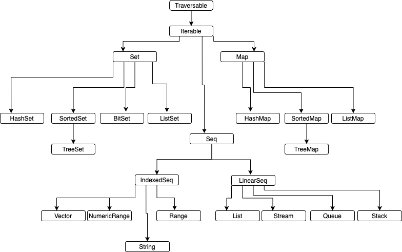

## SIDE EFFECTS
  - Changing Global variables 
  - Storing state
## REFERENCIAL TRANSPERENCY
```strConcate(strA, strB)
   return strA + strB
```
   - For the same input output can be replaced with a constant
## IMMUTABLE
   - If a function has all three principles then its a pure function
## TRAIT
   - A trait is similar to abstract class
   - The difference is that given class can only one abstract class 
   - However, it can extend multiple mix-in
   
## HIGHER ORDER FUNCTION


## COLLECTIONS

   - Linked list are bread and butter of functional programming
   ```
HEAD                               Tail
    \                                /   
     Node1 -> Node2 -> Node3 -> Node4 -> -> -=_
```
## COLLECTION HIERARCHY




## LAZY vs STRICT
``` scala
val list = List("james","ruth","isabel","tom","jerry")

val name = list.filter{n =>
  println(s"Checking $n")
  n.length < 5
}.map{n =>
  println(s"toUpper $n")
  n.toUpperCase
}
******************************
Checking james
Checking ruth
Checking isabel
Checking tom
Checking jerry
toUpper ruth
toUpper tom
******************************
```
- Iterator passes all the elements for every higher order function
- In the above all the names are iterated over first filter function to filter elements < 5
- Then the elements are passed to uppercase

```
val lazyName = LazyList("james","ruth","isabel","tom","jerry")

val nameStream = lazyName.filter{n =>
  println(s"Checking $n")
  n.length < 5
}.map{n =>
  println(s"toUpper $n")
  n.toUpperCase
}
nameStream(1)
******************************
Checking james
Checking ruth
toUpper ruth
Checking isabel
Checking tom
toUpper tom
******************************
```
- stream is evaluated only terminated with action
- based on the action only required elements are processed
- in the above output not all the elements are iterated only until it satisfies the action
